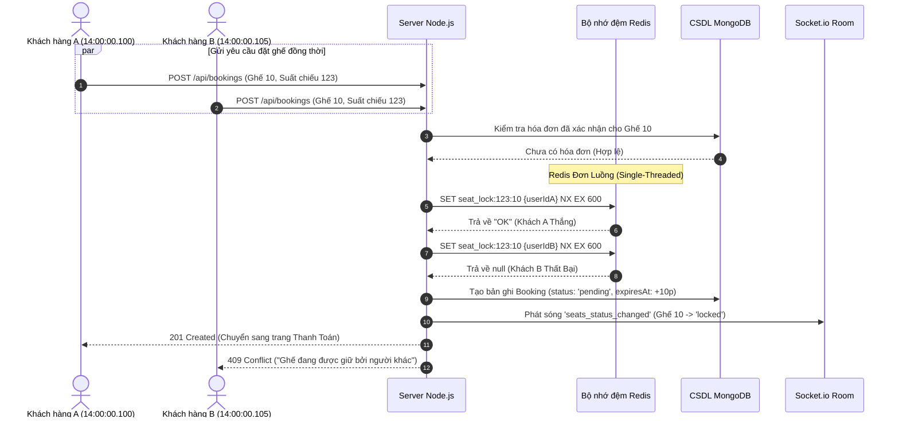
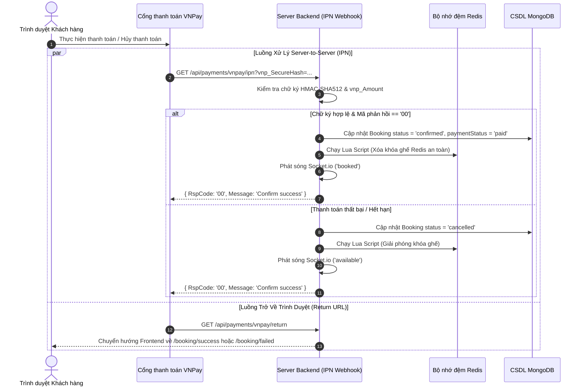

[README.md](https://github.com/user-attachments/files/31607433/README.md)
# 🎬 CineBooking — Hệ Thống Đặt Vé Xem Phim Trực Tuyến Chịu Tải Cao

[](https://nodejs.org/)
[](https://expressjs.com/)
[](https://react.dev/)
[](https://www.typescriptlang.org/)
[](https://www.mongodb.com/)
[](https://redis.io/)
[](https://socket.io/)

Hệ thống đặt vé xem phim Full-stack hoàn chỉnh được thiết kế với giao diện hiện đại mang phong cách Netflix. Dự án được tối ưu hóa kiến trúc để giải quyết bài toán **khóa ghế phân tán thời gian thực (Concurrency Control)**, **đồng bộ trạng thái tức thời qua WebSocket**, **tích hợp thanh toán an toàn VNPay**, và **trang quản trị phân tích dữ liệu kinh doanh (BI Analytics)**.

---

## 🚀 Điểm Sáng Kiến Trúc & Kỹ Thuật

* 🔒 **Khóa Ghế Phân Tấn (Xóa bỏ 100% Race Condition):** Sử dụng các thao tác nguyên tử (Atomic Operations) của Redis (`SETNX` kèm `EX` TTL) và **Lua Scripts** để giải phóng khóa an toàn, loại bỏ hoàn toàn nguy cơ trùng ghế khi nhiều người dùng chọn cùng một ghế tại một thời điểm.
* ⚡ **Đồng Bộ Trạng Thái Realtime:** Tích hợp **Socket.io** với cơ chế chia phòng (`showtime_{id}`) để phát sóng ngay lập tức sự thay đổi trạng thái ghế (`ghế trống` ➔ `đang giữ` ➔ `đã bán`) tới toàn bộ người dùng đang xem sơ đồ phòng chiếu.
* 💳 **Tích Hợp Cổng Thanh Toán VNPay Bảo Mật:** Xây dựng **IPN (Instant Payment Notification) Webhook** xác thực chữ ký số **HMAC-SHA512** và kiểm tra khớp số tiền `vnp_Amount`. Tự động hóa cơ chế hoàn trả ghế trống (Rollback) khi giao dịch thất bại hoặc quá hạn 10 phút.
* 📊 **Báo Cáo Quản Trị BI Tốc Độ Cao (< 200ms):** Tối ưu hóa các câu truy vấn phức tạp (Tỷ lệ lấp đầy phòng chiếu, Doanh thu theo phim, Biểu đồ nhiệt khung giờ cao điểm) bằng **MongoDB Aggregation Pipelines** (`$match`, `$lookup`, `$unwind`, `$group`) và xuất báo cáo Excel tĩnh (`exceljs`).
* 🛡️ **Bảo Mật & Chống Sập Hệ Thống (Resilience):** Triển khai giới hạn tần suất yêu cầu (Rate Limiting) với Redis (`rate-limit-redis`) có cơ chế **fallback tự động sang `MemoryStore`** khi Redis mất kết nối. Bảo vệ phiên đăng nhập với **HttpOnly Cookies** cho Refresh Token và Access Token ngắn hạn.
* 🧠 **Quy Tắc Đặt Ghế Thông Minh:** Kiểm tra phía Client và Server đảm bảo không cho phép người dùng đặt chừa lại một ghế trống đơn lẻ ở hai bên.

---

## 🛠️ Công Nghệ Sử Dụng

### **Phía Backend**
* **Runtime & Framework:** Node.js (v18+), Express.js (v5.x)
* **Cơ sở dữ liệu & ORM:** MongoDB, Mongoose (v9.x)
* **Bộ nhớ đệm & Khóa phân tán:** Redis (ioredis v5.x)
* **Giao tiếp Realtime:** Socket.io (v4.8)
* **Bảo mật & Xác thực:** JWT (JSON Web Tokens), Bcryptjs, Helmet, CORS, Cookie-Parser
* **Tài liệu API & Kiểm tra dữ liệu:** Swagger UI, Swagger JSDoc, Zod
* **Báo cáo & Tiện ích:** ExcelJS, Winston Logger, Morgan, Nodemailer

### **Phía Frontend**
* **Thư viện & Tool Build:** React 19, Vite 8, TypeScript (v6.x)
* **Quản lý trạng thái & Caching:** Zustand, TanStack React Query (v5)
* **Giao diện & Styling:** Tailwind CSS (v3.4), Lucide React Icons
* **Quản lý Form:** React Hook Form, Zod, Hookform Resolvers
* **Trình soạn thảo văn bản:** Tiptap Editor

### **Kiểm thử & Công cụ**
* **Khung kiểm thử:** Jest, Supertest, Mongo Memory Server

---

## 📐 Sơ Đồ Kiến Trúc & Luồng Xử Lý

### 1. Luồng Khóa Ghế Phân Tấn (Chống Tranh Chấp Ghế)



---

### 2. Luồng Webhook VNPay & Tự Động Hoàn Trả Ghế (Rollback)



---

## 🗄️ Mô Hình Cơ Sở Dữ Liệu (Database Schema)

```
 ┌──────────────┐       1:N       ┌──────────────┐       1:N       ┌──────────────┐
 │    Cinema    │ ───────────────>│     Room     │ ───────────────>│     Seat     │
 └──────────────┘                 └──────────────┘                 └──────────────┘
                                         │                                │
                                         │ 1:N                            │ 1:N
                                         ▼                                │
 ┌──────────────┐       1:N       ┌──────────────┐                        │
 │    Movie     │ ───────────────>│   Showtime   │                        │
 └──────────────┘                 └──────────────┘                        │
                                         │ 1:N                            │
                                         ▼                                │
 ┌──────────────┐       1:N       ┌──────────────┐                        │
 │     User     │ ───────────────>│   Booking    │ <──────────────────────┘
 └──────────────┘                 └──────────────┘
        │ 1:N                            │ 1:1
        ▼                                ▼
 ┌──────────────┐                 ┌──────────────┐
 │ RefreshToken │                 │   Payment    │
 └──────────────┘                 └──────────────┘
```

---

## ⚡ Hướng Dẫn Cài Đặt & Chạy Dự Án

### **Yêu cầu môi trường**
* Node.js v18.x trở lên
* MongoDB v6.x trở lên (Local hoặc MongoDB Atlas)
* Redis v7.x trở lên
* npm hoặc pnpm

### **1. Tải Mã Nguồn**
```bash
git clone https://github.com/vovanty0405/CinemaBooking.git
cd CinemaBooking
```

### **2. Cấu Hình Backend**
```bash
cd backend
npm install
```

Tạo tệp `.env` trong thư mục `backend/`:
```env
PORT=3000
NODE_ENV=development
CLIENT_URL=http://localhost:5173

# Cơ sở dữ liệu & Redis
MONGO_URI=mongodb://127.0.0.1:27017/cinebooking
REDIS_HOST=127.0.0.1
REDIS_PORT=6379

# Xác thực JWT
JWT_ACCESS_SECRET=your_access_token_secret_key
JWT_ACCESS_EXPIRES=15m
JWT_REFRESH_SECRET=your_refresh_token_secret_key
JWT_REFRESH_EXPIRES=7d

# Tích hợp Cổng Thanh Toán VNPay
VNPAY_TMN_CODE=YOUR_VNPAY_TMN_CODE
VNPAY_HASH_SECRET=YOUR_VNPAY_HASH_SECRET
VNPAY_URL=https://sandbox.vnpayment.vn/paymentv2/vpcpay.html
VNPAY_RETURN_URL=http://localhost:3000/api/payments/vnpay/return
```

Khởi tạo dữ liệu mẫu (Phim, Rạp, Phòng chiếu, Ghế):
```bash
npm run seed
```

Khởi chạy Server Backend:
```bash
npm run dev
```
> 📍 **Tài liệu API (Swagger UI):** `http://localhost:3000/api-docs`

---

### **3. Cấu Hình Frontend**
```bash
cd ../frontend
npm install
```

Tạo tệp `.env` trong thư mục `frontend/`:
```env
VITE_API_URL=http://localhost:3000/api
VITE_SOCKET_URL=http://localhost:3000
```

Khởi chạy Server Frontend:
```bash
npm run dev
```
> 📍 **Truy cập ứng dụng:** `http://localhost:5173`

---

## 🧪 Kiểm Thử (Testing)

Chạy bộ kiểm thử tự động Unit & Integration Tests với Jest và Mongo Memory Server:
```bash
cd backend
npm test
```

---

## 📮 Danh Sách Các API Chính

| Phương thức | Đường dẫn API | Mô tả | Yêu cầu Auth |
| :--- | :--- | :--- | :--- |
| **POST** | `/api/auth/register` | Đăng ký tài khoản người dùng mới | Không |
| **POST** | `/api/auth/login` | Đăng nhập (Trả về Access Token & set HttpOnly Refresh Cookie) | Không |
| **POST** | `/api/auth/refresh` | Làm mới Access Token tự động | Cookie |
| **GET** | `/api/movies` | Lấy danh sách phim có tìm kiếm và phân trang | Không |
| **GET** | `/api/showtimes/:showtimeId/seats` | Lấy sơ đồ ghế thời gian thực (Trộn DB + Redis) | Không |
| **POST** | `/api/bookings` | Tạo đơn đặt vé tạm thời & khóa ghế trên Redis | Có |
| **POST** | `/api/payments/vnpay/create` | Tạo URL thanh toán VNPay kèm chữ ký SHA-512 | Có |
| **GET** | `/api/payments/vnpay/ipn` | Webhook xử lý thanh toán tự động từ VNPay | Webhook |
| **GET** | `/api/analytics/kpi` | Lấy các chỉ số KPI cho trang quản trị BI | Admin |
| **GET** | `/api/analytics/export` | Xuất báo cáo thống kê ra file Excel (.xlsx) | Admin |

---

## 👤 Tác Giả

**Võ Văn Tỷ** — Backend Engineer
* **Email:** voty365@gmail.com
* **GitHub:** [@vovanty0405](https://github.com/vovanty0405)
* **Số điện thoại:** (+84) 0865 531 963
* **Học vấn:** Trường Đại học An Giang – Đại học Quốc gia TP.HCM (GPA: 3.82 / 4.0)

---
*Dự án được phát triển với niềm đam mê dành cho kiến trúc Backend và hệ thống chịu tải cao.* 🍿🎬
